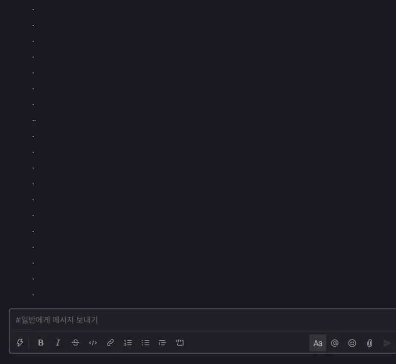

# **Slack bot**

파이썬을 사용한 슬랙봇  
	조원: 이유록

---
# 어떤걸 만들까
#####  내가 필요한 걸 만들자
- 챗봇
	- ~~퇴실처리못해서 3번 결석처리..~~
	- 주고 받을 수 있는 콘텐츠와 형태가 다양하다.
	- 자료도 많고, 혼자 할만 할거같다.
	- 다른사람에게 공유하기 편하며 접근성이 편하다.

---
# 구현할 챗봇의 구조

- 유저의 요청없이 지정된 시간마다 특정행위를 하는것도 가능 (cron)

---
<!-- style: |
  small {
    font-size:20px
  } -->
# 어떤 플랫폼을 고를까 - 1

- 편한 접근성, 간단한 기능인 경우 웹플랫폼에서 직접 작성가능 ex) FAQ
- 전화번호 계정하나가 더 필요한게 아니라, [카카오 개발자 플랫폼](https://i.kakao.com/)에서 계정 등록하여 사용가능
- 계정 등록에 대한 권한심사 6일정도 소요. 기능이 많아 배우는데 오래 걸릴듯함
---
# 어떤 플랫폼을 고를까 - 2

- 관련 자료가 비교적 많음. 보낼 수 있는 메세지 형태가 카톡보다 훨씬 다양함
- 실제 스타트업에서 많이 쓰이며, 간단한 기능이나 프로덕트 모니터링을 위해서 슬랙 웹훅을 활용하는 경우도 있어 알아두면 좋을거 같았음
- cron job 가능

---
# 슬랙 워크스페이스
- [https://playdatastubot.slack.com/archives/C01EY4N7CRX](https://join.slack.com/t/playdatastubot/shared_invite/zt-j5v7vrt0-z9EneIf4nZjH~rUzdjhLpQ)
	- [일반] 채널

---
# 기능 1 - 특정 지역의 날씨정보 조회

- 사용예시
	- `@playdata_stu_bot /날씨 서초구`
	- `@playdata_stu_bot /날씨 도봉구 방학동`
- 입력한 지역의 현재 날씨를 알려줍니다.

---
# 기능 2 - 개발 블로그 포스트 조회

- 사용예시
	- `@playdata_stu_bot /블로그`
- 최근에 올라온 개발 관련 블로그 글들의 간단한 내용과 링크들의 리스트를 크롤링하여 가져온다.
- 크롤링 출처
	- [awesome-devblog](https://awesome-devblog.netlify.app/)
	- [GeekNews](https://news.hada.io/weekly)

---
# 기능 3 - 결석가능일 조회

- 사용예시
	- `@playdata_stu_bot /결석 1`
	- `@playdata_stu_bot /결석 3`
- 이번달 소정훈련일수와 이번달 결석한 횟수에 비례해서 재적위험까지 얼마나 남았는지 알려줌

---
# 기능 4 - 기능 확인

- 사용예시
	- `@playdata_stu_bot /help`
- 현재 봇에 등록된 기능들에 대한 설명서를 조회한다.

---
# 간단하게 크론이란?

- 특정 작업을 고정된 시간, 날짜, 간격에 주기적으로 실행할 수 있도록 스케줄링하기 위해 cron을 사용한다. (출처: 위키백과)
---
# cron 1 - 출퇴근 알림

- 작동시간
	- AM 8:50
	- PM 18:00
- 기능
	- HRD 출퇴근 처리를 위한 QR코드를 이미지로 보내준다.

---
# cron 2 - 목 스트레칭 알림

- 작동시간
	- 9~17시 한시간
- 기능
	- 목 스트레칭 알람과 자세를 판단할 수 있는 링크를 보내준다.

---
# cron 2_1 - 목 스트레칭

- google의 [teachable machine](https://teachablemachine.withgoogle.com/)을 활용한 신체 자세 감지웹앱
- [직접해보기](https://padawanr0k.github.io/tm_stretch_pos/)

---
# 사용 스택
- 서버 프레임워크
	- flask (python)
- 프론트
	- react (js)
- 배포 플랫폼
	- [heroku](https://www.heroku.com/)(서버), [github pages](https://pages.github.com/)(프론트)
---
# 프로젝트 일정

---
# 느낀점
- 장점
	- 해보고 싶었던걸 마음대로 구현해 볼 수 있었다.
- 단점
	- 혼자하려니까 뭘 어디부터 시작 해야할지 막막해서 힘들었다.
	- 처음 해보는 부분이라 삽질하는 부분이 많았어서 시간이 생각보다 오래 걸림
---

<!--
_color: #333
_backgroundColor: #fff
_backgroundImage: ()
-->

# 감사합니다.

 
 
 
 
 

### -끝-
